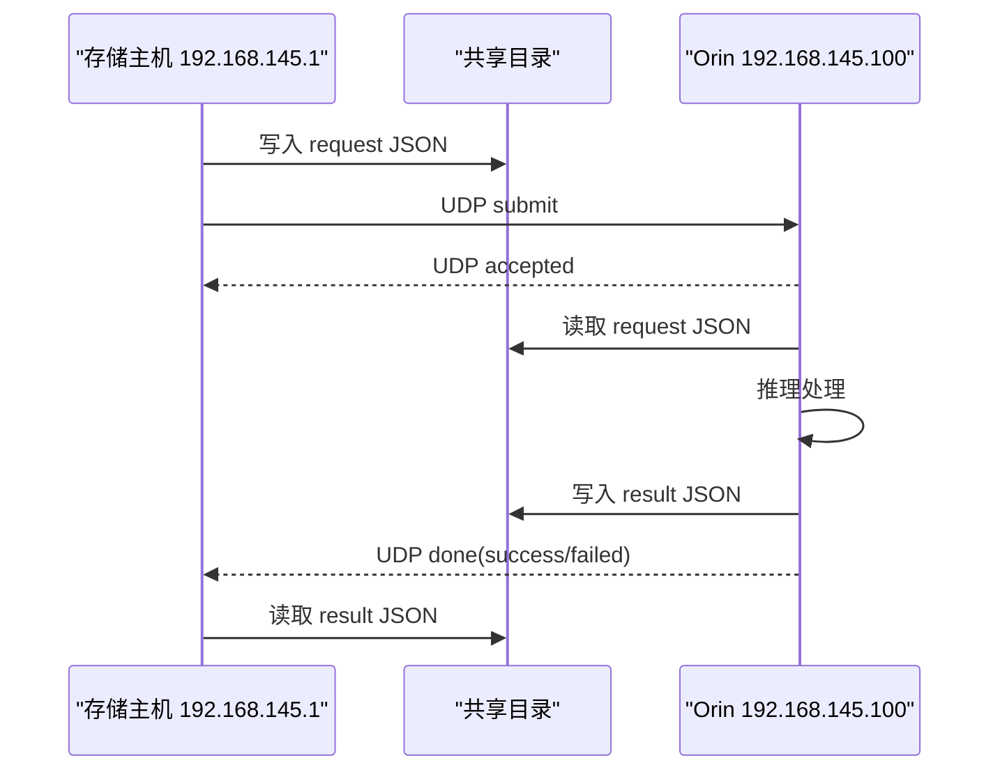

# 软件侧 UDP 联调接口文档（一页版）

## 1. 通信方式

- 大文件通过共享目录传输
- UDP 只传任务提交和状态通知
- 不通过 UDP 传图片、不传大 JSON

## 2. 网络信息

- 存储主机：`192.168.145.1`
- Orin 算法服务：`192.168.145.100`
- Orin UDP 监听端口：`9000`
- 软件侧接收回包端口：例如 `9001`

## 3. 路径约定

- UDP 中只传共享目录相对路径
- 统一使用 `/`
- 不能传 Windows 盘符路径
- 不能传 Linux 绝对路径
- 不能包含 `..`

示例：

- `requests/2026/03/25/00001_1023.553_183701383.json`
- `results/2026/03/25/task-1_result.json`

## 4. 软件侧发送 UDP 提交 JSON

```json
{
  "cmd": "submit",
  "protocol_version": "1.0",
  "task_id": "8c8ea8f0-d1bc-4b38-a812-7eec537794b5",
  "request_relpath": "requests/2026/03/25/00001_1023.553_183701383.json",
  "result_relpath": "results/2026/03/25/8c8ea8f0-d1bc-4b38-a812-7eec537794b5_result.json",
  "reply_ip": "192.168.145.1",
  "reply_port": 9001
}
```

## 5. Orin 返回已接收 JSON

```json
{
  "cmd": "accepted",
  "protocol_version": "1.0",
  "task_id": "8c8ea8f0-d1bc-4b38-a812-7eec537794b5",
  "status": "accepted",
  "result_relpath": "results/2026/03/25/8c8ea8f0-d1bc-4b38-a812-7eec537794b5_result.json"
}
```

说明：

- 表示任务已成功接收并入队
- 收到后不要重复提交同一个 `task_id`

## 6. Orin 返回处理成功 JSON

```json
{
  "cmd": "done",
  "protocol_version": "1.0",
  "task_id": "8c8ea8f0-d1bc-4b38-a812-7eec537794b5",
  "status": "success",
  "result_relpath": "results/2026/03/25/8c8ea8f0-d1bc-4b38-a812-7eec537794b5_result.json"
}
```

说明：

- 结果文件已生成
- 软件侧按 `result_relpath` 去共享目录读取结果 JSON

## 7. Orin 返回处理失败 JSON

```json
{
  "cmd": "done",
  "protocol_version": "1.0",
  "task_id": "8c8ea8f0-d1bc-4b38-a812-7eec537794b5",
  "status": "failed",
  "result_relpath": "results/2026/03/25/8c8ea8f0-d1bc-4b38-a812-7eec537794b5_result.json",
  "error": "decode image failed"
}
```

## 8. 软件侧处理流程

1. 先把输入 JSON 写入共享目录
2. 向 `192.168.145.100:9000` 发送 `submit`
3. 等待 `accepted`
4. 再等待 `done`
5. 若 `success`，按 `result_relpath` 读取结果文件
6. 若 `failed`，记录 `error`

## 9. 重试规则

- 若短时间内没收到任何回包，可以重发
- 重发时必须使用同一个 `task_id`
- 收到 `accepted` 后不要再重发
- `task_id` 是幂等键，不能在同一任务里变化

## 10. 一条完整联调示例

- 软件侧先写文件：
  `Z:\rail_share\requests\2026\03\25\00001_1023.553_183701383.json`
- 软件侧发送 UDP：
  `task_id=8c8ea8f0-d1bc-4b38-a812-7eec537794b5`
- Orin 返回：
  `accepted`
- Orin 处理完成后返回：
  `done + success`
- 软件侧读取结果：
  `Z:\rail_share\results\2026\03\25\8c8ea8f0-d1bc-4b38-a812-7eec537794b5_result.json`

## 11. 时序图


